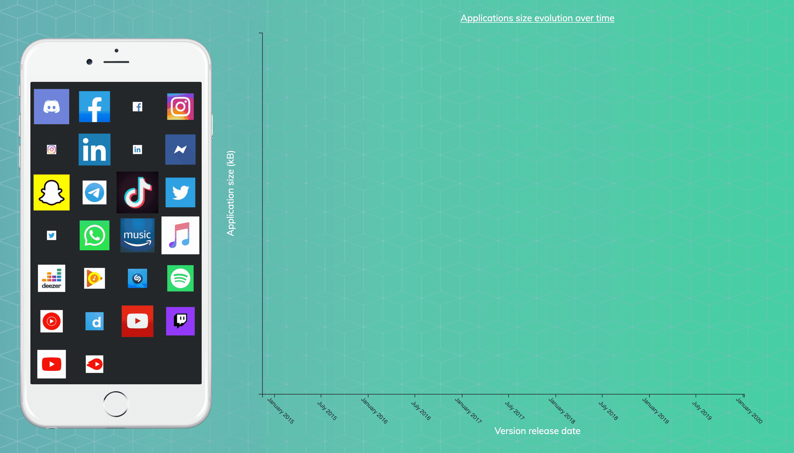

# [Dataviz - Applications Memory Consumption](https://github.com/Sitiel/dataviz_6)


> The English version of the README can be found [here](README.md).
>
> La version anglaise du README peut être trouvée [ici](README.md).

La mémoire de notre téléphone est souvent perçue comme un élément limitant les fonctionnalités de nos appareils, nous empêchant d'installer certaines applications devenues parfois trop gourmande en termes d'espace. Il devient également de plus en plus difficile de mettre à jour l'ensemble des applications à cause de leur taille croissante. Mais à quel point cette taille évolue-t-elle au fil des mois ? Existe-t-il des applications alternatives et plus légères pour remplacer celles que nous ne pouvons plus garder ? L'écart de taille entre les applications est-il important entre les téléphones Android et iOS ?

Ce projet universitaire a pour but de visualiser et de clarifier, à travers une page Web, les questions que les utilisateurs ont du mal à cerner avec leur appareil.



***

Ce projet a été développé dans le cadre du cours **Data Visualization**, enseigné à l'[Université Lyon 1](https://www.univ-lyon1.fr/) ([Master en Intelligence Artificielle]((http://master-info.univ-lyon1.fr/IA/))). Le cours peut être trouvé [ici](https://lyondataviz.github.io/teaching/lyon1-m2/2019/).

***

## 🔌 Getting Started

Les instructions suivantes vous procureront une copie du projet et le feront fonctionner correctement.

> ⚠️ Notez que nous n'avons pas eu le temps de traduire les chaînes de caractères du projet en anglais. Par conséquent, ils seront tous en français.

### 🔧 Prerequisites

Ce projet est une page Web en HTML, avec CSS et JavaScript. Assurez-vous d'avoir un navigateur mis à jour afin de visualiser correctement la page.

La première étape consiste à cloner le projet:

```bash
git clone https://github.com/Sitiel/dataviz_6.git
```

### 🐘 Exécution (PHP)

Bien que le projet ne soit composé que de fichiers HTML, CSS et JavaScript, la librairie D3.js nécessite des fichiers locaux qui ne peuvent être chargés uniquement via des protocoles Web pour des raisons de sécurité. Ainsi, la page Web doit être lancée à partir d'un serveur, par exemple XAMPP, LAMP ou WAMP.

Si vous possédez une de ces applications, placez le projet dans le dossier `{xampp_lamp_wamp_directory}/htdocs`, où `{xampp_lamp_wamp_directory}` est le répertoire d'installation. Vous pouvez ensuite démarrer le serveur et accéder à la page Web à l'aide de [`http://localhost/`](http://localhost/) ou [`http://localhost/dataviz_6`](http://localhost/dataviz_6) selon la façon dont vous avez copié les fichiers.

### 🐳 Exécution (Docker)

Si Docker est installé sur votre machine, vous pouvez également l'utiliser pour démarrer l'application, avec une simple commande :

```bash
cd dataviz_6
docker-compose up
```

La page Web est ensuite accessible à l'adresse [`http://localhost:8080`](http://localhost:8080).

Lorsque vous souhaitez fermer le conteneur, lancez la commande suivante :

```bash
docker-compose down
```

## 🏗️ Développé avec...

* Les IDEs [JetBrains](https://www.jetbrains.com/) ([PhpStorm](https://www.jetbrains.com/phpstorm/) et [WebStorm](https://www.jetbrains.com/webstorm/))
* HTML, CSS, JavaScript
* [D3.js](https://d3js.org/)
* [Bootstrap](https://getbootstrap.com/)
* [Jupyter Notebook](https://jupyter.org/) / [Python](https://www.python.org/)

## 🗃️ Versioning

Nous utilisons [**git**](https://git-scm.com/) comme VCS, avec [GitHub](https://github.com/).

## 👨‍💻 Auteurs

* Valerian ACIER ([Sitiel](https://github.com/Sitiel))
* Anthony BACCUET ([tobany](https://github.com/tobany))
* Guillaume VANEL ([draguar](https://github.com/draguar))
* Valentin BERGER ([Cynnexis](https://github.com/Cynnexis))

## 📝 Licence

Pas encore de licence sur ce projet...

## 🤝 Remerciements

* Nadieh Bremer pour [RadarGraph.js](http://bl.ocks.org/nbremer/21746a9668ffdf6d8242) (graph compatible avec D3.js). Sa licence peut être trouvée [ici](https://github.com/Sitiel/dataviz_6/blob/master/assets/js/RadarGraph-LICENSE.txt).
* [androidapksfree.com](https://androidapksfree.com/) pour la taille des applications et leur historique sur Android.
* [Apkpure](https://apkpure.com/) pour la taille des applications et leur historique sur Android.
* [Apple - App Store](https://www.apple.com/ios/app-store/) pour la taille des applications sur iOS.
* [Bootstrap Studio](https://bootstrapstudio.io/) pour les modèles HTML, CSS et Bootstrap.
