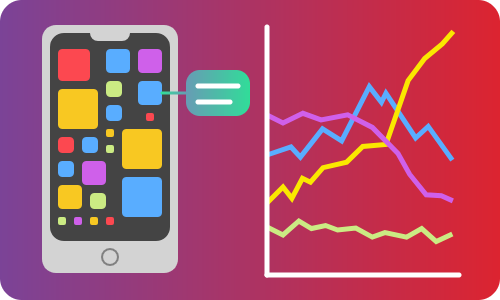

# [Dataviz - Applications Memory Consumption](https://github.com/Sitiel/dataviz_6)



The memory of our phone is often perceived as an element limiting the functionality of our devices, preventing us from installing certain applications that have sometimes become too greedy in terms of space. It's also becoming increasingly difficult to update all the applications due to their increasing size. But how much does this size change over the months? Are there alternatives, lighter apps to replace the ones we can't keep anymore? Is the size difference between applications important between Android and iOS phones?

This school project aim is to, through a web page, visualize and clarify those questions that users find it difficult to outline with their device.

***

This project has been developed as a part of the course **Data Visualization**, taught at the [Université Lyon 1](https://www.univ-lyon1.fr/) ([Master in Artificial Intelligence](http://master-info.univ-lyon1.fr/IA/)). The course can be found [here](https://lyondataviz.github.io/teaching/lyon1-m2/2019/).

***

## 🔌 Getting Started

The following instruction will get you a copy of the project, and make it run properly.

> ⚠️ Note that we, unfortunately, didn't have time to translate the strings of the project in English. As a result, they will all be in French. However, as the texts on the web page are only placed to describe the project and discuss the result, it should not be a problem if you intend to use the application to see the visualization we offer.

### 🔧 Prerequisites

This project is a web page in HTML, with CSS and JavaScript. Make sure to have an updated browser in order to visualize correctly the page.

The first step is to clone the project:

```bash
git clone https://github.com/Sitiel/dataviz_6.git
```

### 🐘 Run (PHP)

Although the project is only composed of HTML, CSS, and JavaScript, the library D3.js requires local files that can only be loaded through web protocols for security reasons. In order to do so, the web page must be launched from a server, for instance, XAMPP, LAMP or WAMP.

If you have one of those applications, place the project under the folder `{xampp_lamp_wamp_directory}/htdocs`, where `{xampp_lamp_wamp_directory}` is the installation directory. You can then start the server and access the web page using `http://localhost/` or `http://localhost/dataviz_6` depending on how you copied the files.

### 🐳 Run (Docker)

If you have Docker installed on your machine, you can also use it to start the application, with a simple command:

```bash
cd dataviz_6
docker-compose up
```

The web page can then be accessed at `http://localhost:8080`.

When you wish to close the container, launch the following command:

```bash
docker-compose down
```

## 🏗️ Built With

* [JetBrains](https://www.jetbrains.com/) IDEs ([PhpStorm](https://www.jetbrains.com/phpstorm/) and [WebStorm](https://www.jetbrains.com/webstorm/))
* HTML, CSS, JavaScript
* [D3.js](https://d3js.org/)
* [Bootstrap](https://getbootstrap.com/)
* [Jupyter Notebook](https://jupyter.org/) / [Python](https://www.python.org/)

## 🗃️ Versioning

We use [**git**](https://git-scm.com/) as a version control system, with [GitHub](https://github.com/).

## 👨‍💻 Authors

* Valerian ACIER ([Sitiel](https://github.com/Sitiel))
* Anthony BACCUET ([tobany](https://github.com/tobany))
* Guillaume VANEL ([draguar](https://github.com/draguar))
* Valentin BERGER ([Cynnexis](https://github.com/Cynnexis))

## 📝 License

No license on this project yet...

## 🤝 Acknowledgments

* Nadieh Bremer for [RadarGraph.js](http://bl.ocks.org/nbremer/21746a9668ffdf6d8242) (D3.js-compatible graph). Its license can be found [here](https://github.com/Sitiel/dataviz_6/blob/master/assets/js/RadarGraph-LICENSE.txt).
* [androidapksfree.com](https://androidapksfree.com/) for the size of the applications and history on Android.
* [Apkpure](https://apkpure.com/) for the size of the applications and history on Android.
* [Apple - App Store](https://www.apple.com/ios/app-store/) for the size of the applications on iOS.
* [Bootstrap Studio](https://bootstrapstudio.io/) for the HTML, CSS and Bootstrap template.
